# Web3 Metrological Traceability Marketplace - MVP PRD

## Chainlink Chromion Hackathon

### Executive Summary

A decentralized marketplace that revolutionizes metrological calibration services by generating Digital Calibration Certificates (DCCs) as NFTs with on-chain verification, automated validation, and guaranteed traceability to the International System of Units (SI).

### Problem Statement

Current calibration certificate management faces critical challenges:

- **Integrity Issues**: XML/PDF files can be altered post-issuance without leaving traces
- **Traceability Gaps**: Difficult to guarantee instrument calibration is traceable to SI standards
- **Validation Complexity**: No easy, public, reliable way to verify DCC validity or expiration
- **Credential Verification**: Lack of real-time standardization to verify laboratory accreditation status

### Solution Overview

A **decentralized Web3 marketplace** that:

- Enables accredited laboratories to offer calibration services digitally
- Generates DCCs as NFTs with verifiable on-chain data
- Utilizes Chainlink Functions and Automation for verification, traceability, and automatic validity management

### Target Users & Market Analysis

**Primary Actors:**

1. **Accredited Laboratories**

   - Offer calibration services
   - Generate and issue DCCs
   - Must hold ISO/IEC 17025 accreditation

2. **Industrial Clients / Hospitals**

   - Purchase calibration services
   - Receive DCC NFTs
   - Require certified equipment for compliance

3. **Auditors/Verifiers**

   - Verify certificate authenticity and integrity
   - Validate against NMI (National Metrology Institute) data
   - Ensure regulatory compliance

4. **NMIs (NIST, PTB, INMETRO)**
   - Provide credential validation via APIs
   - Maintain traceability standards
   - Authority for accreditation verification

5. ** Others ?! **
   - Health insurance ?

**Marketplace Actors:** - All actors are present for a functional marketplace :hand: :rotating_light:

- **Suppliers**: Accredited Laboratories
- **Buyers**: Industrial Clients
- **Validators**: Auditors/Verifiers
- **Authority**: NMIs
- **Infrastructure**: Smart contracts + Chainlink oracles

### Core Features (MVP)

#### 1. Laboratory Registration & Verification

- **Chainlink Functions Integration**: Automatic ISO/IEC 17025 accreditation verification via NMI APIs
- Laboratory profile creation with credentials display
- Continuous accreditation status monitoring

#### 2. Service Marketplace

- Laboratory service listings (instrument type, precision, price, timeline)
- Service discovery and filtering capabilities
- Smart contract-based escrow system (ETH/stablecoins)

#### 3. DCC NFT Generation

- XML-based DCC upload to IPFS
- NFT minting with embedded metadata:
  - IPFS hash of calibration certificate
  - Issuance and expiration dates
  - Laboratory credentials
  - Traceability chain information
- Immutable certificate integrity

#### 4. Automated Lifecycle Management

- **Chainlink Automation**:
  - Automatic certificate expiration handling
  - Periodic audit triggers
  - Status updates and notifications

#### 5. Verification System

- Public certificate authenticity verification
- On-chain validation against NMI data
- Real-time accreditation status checks

### Technical Architecture

#### Smart Contracts

- **MarketplaceCore**: Service listings and transactions
- **DCCRegistry**: NFT minting and metadata management
- **LaboratoryRegistry**: Accreditation verification and status

#### Chainlink Integration

- **Functions**: NMI API calls for credential verification
- **Automation**: Certificate lifecycle management
- **Price Feeds**: Multi-currency payment support (if needed)

#### Storage

- **IPFS**: Decentralized certificate storage
- **On-chain**: Metadata, hashes, and verification data

### User Journey :mag:

The following sections detail the complete user experience across all stakeholders in the marketplace:

#### 1. Laboratory Onboarding

**Objective**: Get accredited laboratories verified and active on the platform

**Steps:**

- **Connect Wallet**: Laboratory connects their Web3 wallet to the platform
- **Register Profile**: Complete laboratory information including contact details, specializations, and certifications
- **Submit Credentials**: Upload ISO/IEC 17025 accreditation documents and relevant certifications
- **Wait for Verification**: System processes submitted credentials
- **Chainlink Verifies ISO**: Automated verification via NMI APIs using Chainlink Functions
- **Accreditation Confirmed**: Laboratory receives confirmation of successful verification
- **Profile Goes Live**: Laboratory profile becomes visible and active on the marketplace

**Pain Points**: Initial wallet connection for Web3 newcomers, credential document preparation
**Success Metrics**: Time to verification, verification success rate, laboratory activation rate

#### 2. Service Creation

**Objective**: Enable laboratories to list their calibration services effectively

**Steps:**

- **Define Service Types**: Specify instruments that can be calibrated (pressure gauges, thermometers, scales, etc.)
- **Set Pricing & Timeline**: Establish service costs and expected turnaround times
- **Upload Capabilities**: Detail precision levels, measurement ranges, and technical specifications
- **Publish to Marketplace**: Make services discoverable to potential clients
- **Service Listed**: Confirmation that services are live and bookable

**Pain Points**: Accurate pricing strategy, technical specification communication
**Success Metrics**: Number of services listed, service booking rate, pricing competitiveness

#### 3. Client Discovery

**Objective**: Help industrial clients find appropriate calibration services

**Steps:**

- **Browse Marketplace**: Explore available calibration services
- **Filter by Requirements**: Use search filters (instrument type, location, precision, price)
- **Compare Labs & Prices**: Evaluate different laboratory options
- **Check Lab Credentials**: Review accreditation status and verification history
- **Read Reviews/History**: Examine past client feedback and service history
- **Select Service**: Choose preferred laboratory and service package

**Pain Points**: Service comparison complexity, trust establishment with new laboratories
**Success Metrics**: Search-to-selection conversion rate, time spent in discovery phase

#### 4. Service Purchase

**Objective**: Facilitate secure and transparent service transactions

**Steps:**

- **Review Service Details**: Final confirmation of service specifications and terms
- **Connect Wallet**: Client connects Web3 wallet for payment
- **Confirm Payment**: Authorize payment transaction (ETH/stablecoins)
- **Smart Contract Escrow**: Funds held securely until service completion
- **Purchase Confirmed**: Transaction confirmed on blockchain
- **Lab Notified**: Laboratory receives service order notification

**Pain Points**: Web3 payment process for traditional industrial clients, gas fees
**Success Metrics**: Payment completion rate, escrow security, transaction speed

#### 5. Calibration Process

**Objective**: Execute physical calibration and prepare digital certification

**Steps:**

- **Prepare Equipment**: Laboratory prepares calibration setup and reference standards
- **Ship to Client**: Coordinate equipment pickup/delivery (if applicable)
- **Perform Calibration**: Execute physical calibration procedures
- **Generate DCC XML**: Create digital calibration certificate in standardized XML format
- **Quality Check**: Internal validation of calibration results and certificate accuracy
- **Upload to IPFS**: Store DCC XML on decentralized storage network

**Pain Points**: Logistics coordination, XML format standardization, quality assurance
**Success Metrics**: Calibration accuracy, turnaround time, certificate quality

#### 6. Certificate Issuance

**Objective**: Generate immutable DCC NFTs with verified metadata

**Steps:**

- **Submit Certificate Hash**: Laboratory submits IPFS hash and certificate metadata
- **Smart Contract Validation**: System validates certificate format and laboratory credentials
- **Mint DCC NFT**: Create unique NFT representing the calibration certificate
- **Transfer to Client**: Automatically transfer NFT to client's wallet
- **Release Payment**: Escrow funds released to laboratory
- **Notification Sent**: Both parties receive completion notifications

**Pain Points**: Technical complexity of NFT operations, gas costs for minting
**Success Metrics**: NFT minting success rate, payment release time, client satisfaction

#### 7. Certificate Usage

**Objective**: Enable clients to utilize and verify their calibration certificates

**Steps:**

- **Receive DCC NFT**: Client receives NFT in their wallet
- **Verify Certificate**: Use platform tools to verify certificate authenticity
- **Show to Auditors**: Present certificate for compliance verification
- **Compliance Check**: Auditors validate certificate against regulatory requirements
- **Certificate Valid**: Confirmation of certificate acceptance for compliance purposes

**Pain Points**: NFT management for non-crypto users, auditor education on Web3 certificates
**Success Metrics**: Certificate acceptance rate, auditor satisfaction, compliance success

#### 8. Ongoing Management

**Objective**: Maintain certificate validity and schedule renewals

**Steps:**

- **Monitor Expiration**: Track certificate validity periods
- **Automation Checks**: Chainlink Automation monitors certificate status
- **Renewal Notification**: Automated alerts before certificate expiration
- **Schedule Re-calibration**: Plan future calibration services
- **Repeat Process**: Continuous cycle of calibration and certification

**Pain Points**: Certificate lifecycle tracking, renewal timing optimization
**Success Metrics**: Renewal rate, client retention, automated notification effectiveness

#### 9. Verification & Audit

**Objective**: Provide transparent and reliable certificate verification

**Steps:**

- **Access Public Registry**: Auditors access the public certificate registry
- **Query DCC NFT**: Look up specific certificates by ID or client
- **Verify Lab Credentials**: Check laboratory accreditation status
- **Check Traceability**: Validate calibration traceability chain to SI standards
- **Validate Against NMI**: Cross-reference with National Metrology Institute data
- **Audit Complete**: Provide verification report and compliance confirmation

**Pain Points**: Auditor training on Web3 verification, integration with existing audit processes
**Success Metrics**: Verification speed, audit pass rate, auditor adoption

### Metrological Traceability Chain

The platform ensures traceability through the established hierarchy:

```mermaid
flowchart TD
    A["🌌 SI Fundamental Units<br/>(via Natural Constants)"]
    B["🌍 International Standards<br/>(BIPM - Bureau International<br/>des Poids et Mesures)"]
    C["🏛️ National Standards<br/>(National Metrology Institutes)<br/>• NIST (USA)<br/>• PTB (Germany)<br/>• INMETRO (Brazil)"]
    D["🔬 Accredited Laboratory<br/>Reference Standards<br/>• ISO/IEC 17025 Certified"]
    E["⚙️ Laboratory Calibration<br/>Equipment"]
    F["📋 Client Equipment<br/>Calibration (DCC NFT)"]
    A --> B
    B --> C
    C --> D
    D --> E
    E --> F
    style A fill:#e1f5fe,stroke:#0277bd,stroke-width:3px
    style B fill:#f3e5f5,stroke:#7b1fa2,stroke-width:3px
    style C fill:#e8f5e8,stroke:#388e3c,stroke-width:3px
    style D fill:#fff3e0,stroke:#f57c00,stroke-width:3px
    style E fill:#fce4ec,stroke:#c2185b,stroke-width:3px
    style F fill:#e0f2f1,stroke:#00796b,stroke-width:3px,stroke-dasharray: 5 5
```

### Success Metrics

#### User Adoption

- Number of registered laboratories
- Number of registered clients
- Total calibration services listed
- Client acquisition and retention rates

#### Transaction Volume

- Total calibration services purchased
- Average transaction value :tickets:
- Payment processing success rate

#### Technical Performance

- Certificate verification success rate
- NMI API integration uptime
- NFT minting success rate
- Chainlink oracle reliability

### Development Timeline (Hackathon) :stop_sign: :arrow_forward: Tudo chutado aqui!

#### Phase 1: Foundation (3 days) :exclamation:

- Smart contract architecture
- Basic marketplace functionality
- Laboratory registration system

#### Phase 2: Integration (4 days) :exclamation:

- Chainlink Functions for NMI verification
- IPFS integration for certificate storage
- NFT minting mechanism
- Avalanche integration :white_circle:

#### Phase 3: Automation (5 days) :exclamation:

- Chainlink Automation implementation
- Certificate lifecycle management
- Verification system
- ElizaOS integration (AI Agents) :white_circle:

#### Phase 4: Polish & Demo (7 days) :exclamation:

- UI/UX refinements
- Demo preparation
- Documentation completion
- Pitch preparation

### Technical Risks & Mitigation :stop_sign: :arrow_forward: Precisa melhorar!

#### NMI API Integration

- **Risk**: Limited or unreliable API access
- **Mitigation**: Mock APIs for demo, manual verification fallback

#### IPFS Reliability

- **Risk**: Content availability issues
- **Mitigation**: Multiple IPFS gateways, backup storage solutions

#### Oracle Dependencies

- **Risk**: Chainlink service limitations
- **Mitigation**: Graceful degradation, manual override capabilities

### Competitive Advantages

1. **First-mover advantage** in Web3 calibration marketplace :question:
2. **Automated traceability** ensuring SI compliance
3. **Immutable certificates** preventing fraud
4. **Real-time verification** reducing audit costs
5. **Decentralized trust** eliminating single points of failure
6. **Improving efficiency** making the process more effective and productive with less waste :question:

### Future Roadmap

#### Post-MVP Features

- Multi-chain deployment
- Advanced analytics dashboard
- Integration with IoT sensors for real-time monitoring
- Certificate lifecycle automation beyond expiration
- Advanced reputation systems for laboratories

#### Scalability Considerations

- Cross-chain compatibility
- Enterprise API development
- Mobile application

### Focus

This MVP addresses critical pain points in metrological calibration while leveraging Web3 technologies to create a trustless, transparent, and automated marketplace. The integration of Chainlink oracles, ElizaOS and Avalanche ensures real-world data verification, making this solution both technically innovative and practically valuable for the industrial calibration market.
